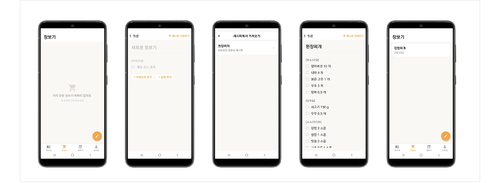
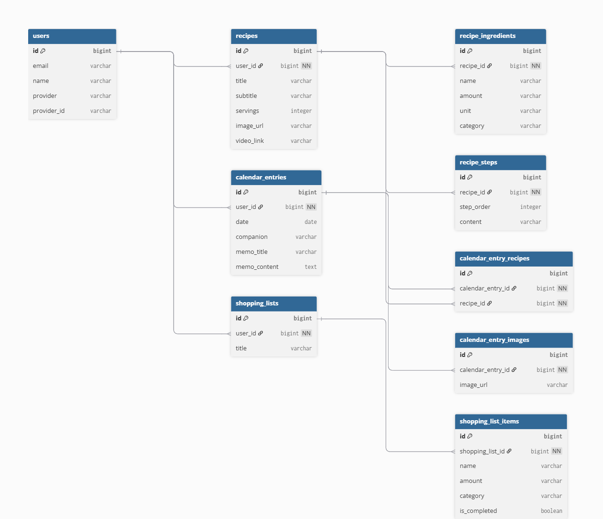
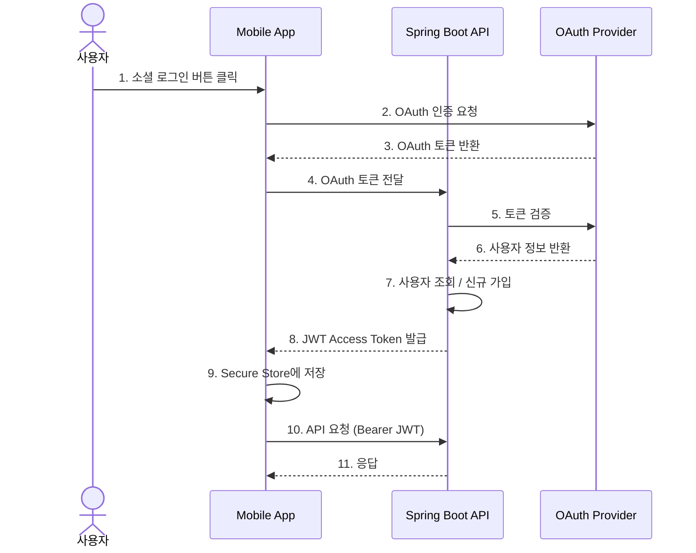

# PawNote

## 소개

PawNote는 레시피를 저장하고 관리를 하고싶은 사람들을 위한 종합 관리 앱입니다. 직접 만든 레시피를 기록하고, 일상 활동을 캘린더로 관리하며, 필요한 재료를 쇼핑 리스트로 정리할 수 있습니다.

---

## 목차

- [주요 기능](#주요-기능)
- [기술 스택](#기술-스택)
- [아키텍처](#아키텍처)
- [프로젝트 구조](#프로젝트-구조)
- [화면 구성](#화면-구성)
- [ERD 다이어그램](#ERD-다이어그램)
- [인증 흐름](#인증-흐름)
- [API 엔드포인트](#api-엔드포인트)
- [시작하기](#시작하기)
- [환경 변수](#환경-변수)

---

## 주요 기능

| 기능 | 설명 |
|------|------|
| **레시피 관리** | 재료, 조리 순서, 사진, 영상 링크를 포함한 레시피 생성·조회·수정·삭제 |
| **캘린더** | 날짜별 레시피 만든 활동 기록 (사진, 동반자 정보, 레시피 연동, 메모) |
| **장보기 리스트** | 레시피 재료 장보기 목록 관리 (재료 카테고리별 생성 포함) |
| **소셜 로그인** | Google, Kakao, Naver OAuth 지원 |

---

## 기술 스택

### 📱 Frontend (Mobile)


### Backend


---

## 아키텍처


---

## 프로젝트 구조

```
PawNote/
├── backend/                          # Spring Boot REST API
│   └── src/main/java/com/pawnote/
│       ├── auth/                     # 인증 (JWT, OAuth)
│       ├── recipe/                   # 레시피 도메인
│       ├── calendar/                 # 캘린더 도메인
│       ├── shoppinglist/             # 쇼핑 리스트 도메인
│       ├── user/                     # 사용자 엔티티
│       ├── common/                   # 공통 (파일 스토리지 등)
│       ├── config/                   # 보안 설정 (SecurityConfig)
│       └── health/                   # 헬스체크
│
└── mobile/                           # React Native / Expo 앱
    ├── app/
    │   ├── (auth)/                   # 로그인 화면
    │   ├── (tabs)/                   # 하단 탭 (레시피·쇼핑·캘린더·프로필)
    │   ├── recipe/                   # 레시피 상세·생성·수정
    │   ├── calendar/                 # 캘린더 생성·수정
    │   ├── shopping/                 # 쇼핑 리스트 상세·생성
    │   └── auth/                     # OAuth 콜백 처리
    ├── components/                   # 공통 UI 컴포넌트
    ├── services/                     # API 클라이언트
    ├── stores/                       # Zustand 전역 상태
    ├── hooks/                        # 커스텀 훅 (React Query)
    ├── types/                        # TypeScript 타입 정의
    └── constants/                    # 앱 상수·환경 변수
```

---

## 화면 구성

| 메인 | 레시피 |
|:---:|:---:|
|  |  |

| 캘린더 | 쇼핑 리스트 |
|:---:|:---:|
|  |  |

---

## ERD 다이어그램



---

## 인증 흐름



---

## API 엔드포인트

### 인증
| Method | Endpoint | 설명 |
|--------|----------|------|
| POST | `/auth/google` | Google 로그인 |
| GET | `/auth/kakao/callback` | Kakao OAuth 콜백 |
| POST | `/auth/kakao/exchange` | Kakao 토큰 교환 |
| GET | `/auth/naver/start` | Naver OAuth 시작 |
| GET | `/auth/naver/callback` | Naver OAuth 콜백 |
| POST | `/auth/naver/exchange` | Naver 토큰 교환 |

### 레시피
| Method | Endpoint | 설명 |
|--------|----------|------|
| GET | `/api/recipes` | 레시피 목록 조회 (페이지네이션) |
| GET | `/api/recipes/{id}` | 레시피 상세 조회 |
| GET | `/api/recipes/search?keyword=` | 레시피 검색 |
| POST | `/api/recipes` | 레시피 생성 (multipart) |
| PUT | `/api/recipes/{id}` | 레시피 수정 |
| DELETE | `/api/recipes/{id}` | 레시피 삭제 |

### 캘린더
| Method | Endpoint | 설명 |
|--------|----------|------|
| GET | `/api/calendar?year=&month=` | 월별 캘린더 조회 |
| GET | `/api/calendar/date/{date}` | 날짜별 항목 조회 |
| POST | `/api/calendar` | 캘린더 항목 생성 (multipart) |
| PUT | `/api/calendar/{id}` | 캘린더 항목 수정 |
| DELETE | `/api/calendar/{id}` | 캘린더 항목 삭제 |

### 쇼핑 리스트
| Method | Endpoint | 설명 |
|--------|----------|------|
| GET | `/shopping-lists` | 쇼핑 리스트 목록 조회 |
| GET | `/shopping-lists/{id}` | 쇼핑 리스트 상세 조회 |
| POST | `/shopping-lists` | 쇼핑 리스트 생성 |
| PUT | `/shopping-lists/{id}` | 쇼핑 리스트 수정 |
| DELETE | `/shopping-lists/{id}` | 쇼핑 리스트 삭제 |

### 기타
| Method | Endpoint | 설명 |
|--------|----------|------|
| GET | `/health` | 서버 상태 확인 |

---

## 시작하기

### 사전 요구 사항

- Java 17+
- Node.js 18+
- PostgreSQL
- Supabase 프로젝트
- Google / Kakao / Naver OAuth 앱 등록

### Backend 실행

```bash
cd backend

# 환경 변수 설정 후
./gradlew bootRun
```

### Mobile 실행

```bash
cd mobile

pnpm install

# Expo Go로 실행 (QR 코드 스캔)
npx expo start

# USB로 연결된 Android 기기에서 실행
npx expo run:android
```

---

## 환경 변수

### Backend (환경 변수)

| 변수명 | 설명 |
|--------|------|
| `DB_URL` | PostgreSQL 연결 URL |
| `DB_USERNAME` | DB 사용자명 |
| `DB_PASSWORD` | DB 비밀번호 |
| `JWT_SECRET` | JWT 서명 키 |
| `JWT_ACCESS_EXPIRATION` | Access Token 만료 시간 (ms) |
| `GOOGLE_CLIENT_ID` | Google OAuth Client ID |
| `KAKAO_CLIENT_ID` | Kakao REST API Key |
| `KAKAO_CLIENT_SECRET` | Kakao Client Secret |
| `KAKAO_REDIRECT_URI` | Kakao 서버 리다이렉트 URI |
| `KAKAO_APP_REDIRECT_URI` | Kakao 앱 리다이렉트 URI |
| `NAVER_CLIENT_ID` | Naver Client ID |
| `NAVER_CLIENT_SECRET` | Naver Client Secret |
| `NAVER_REDIRECT_URI` | Naver 서버 리다이렉트 URI |
| `NAVER_APP_REDIRECT_URI` | Naver 앱 리다이렉트 URI |
| `SUPABASE_URL` | Supabase 프로젝트 URL |
| `SUPABASE_SERVICE_ROLE_KEY` | Supabase Service Role Key |
| `SUPABASE_BUCKET` | 이미지 업로드 버킷명 |

**예시 (IntelliJ Run Configuration 또는 `.env` 파일)**

```
DB_URL=jdbc:postgresql://localhost:5432/pawnote
DB_USERNAME=postgres
DB_PASSWORD=password1234

JWT_SECRET=my-super-secret-jwt-key-at-least-32-chars
JWT_ACCESS_EXPIRATION=86400000

GOOGLE_CLIENT_ID=1234567890-abcdefg.apps.googleusercontent.com

KAKAO_CLIENT_ID=abcdef1234567890abcdef1234567890
KAKAO_CLIENT_SECRET=your_kakao_client_secret
KAKAO_REDIRECT_URI=http://localhost:8080/auth/kakao/callback
KAKAO_APP_REDIRECT_URI=pawnote://auth/kakao

NAVER_CLIENT_ID=your_naver_client_id
NAVER_CLIENT_SECRET=your_naver_client_secret
NAVER_REDIRECT_URI=http://localhost:8080/auth/naver/callback
NAVER_APP_REDIRECT_URI=pawnote://auth/naver

SUPABASE_URL=https://xxxxxxxxxxx.supabase.co
SUPABASE_SERVICE_ROLE_KEY=eyJhbGciOiJIUzI1NiIsInR5cCI6IkpXVCJ9...
SUPABASE_BUCKET=pawnote-images
```

---

### Mobile (`.env`)

| 변수명 | 설명 |
|--------|------|
| `EXPO_PUBLIC_API_BASE_URL` | 백엔드 API 기본 URL |
| `EXPO_PUBLIC_GOOGLE_WEB_CLIENT_ID` | Google Web Client ID |
| `EXPO_PUBLIC_KAKAO_REST_API_KEY` | Kakao REST API Key |

**예시 (`mobile/.env`)**

```
# 실기기 USB 연결 시 PC의 로컬 IP 주소 사용
EXPO_PUBLIC_API_BASE_URL=http://192.168.0.10:8080

EXPO_PUBLIC_GOOGLE_WEB_CLIENT_ID=1234567890-abcdefg.apps.googleusercontent.com
EXPO_PUBLIC_KAKAO_REST_API_KEY=abcdef1234567890abcdef1234567890
```

> 실기기에서 테스트할 경우 `localhost` 대신 PC의 실제 IP 주소를 입력해야 합니다.
